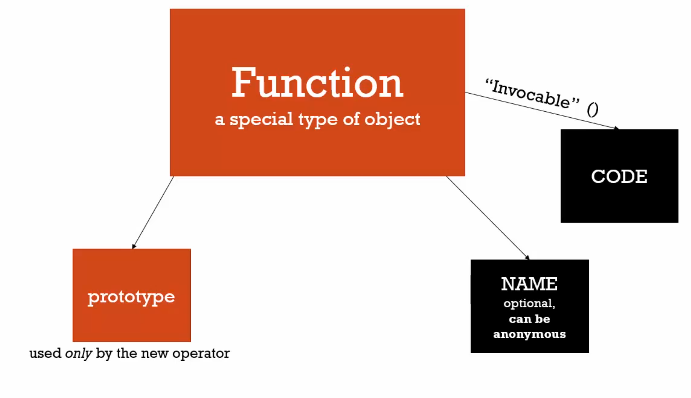

# Understanding Javascript: The Weird Parts

### Functions
* Are special type of objects



### Function Statement
```
function greet(name) {
  console.log("hello " + name);
}
```

### Function Expression
```
var greetFunc = function(name) {
  console.log("Hello " + name);
}
```
* Function is not put into memory initially but during exceution
* JS engine create the function on the fly as soon it hits the line number

### IIFE - Immediately Invoked Function Expression
```
(function(name) {
  console.log("Hello " + name);
}());
```
* First word of the function statement must be a function
* Wrapping function statement in a () tricks syntax parser to think it is a function expression and crates the object on the fly and invokes it, all at the same time.
* Creates its own extecution context so all variables inside it are isolated from outer environment.

### Closures
Watch Video

### .bind(), .apply(), call()
### .bind()
Creates a coy of whatever functions it is called on and object passed to it will be the refrence by
`this`


### Inheritance
One object get access to properties and methods of another object.

### Prototype
All objects have prototype property.

### Reflection and Extend
Reflection - An object can look ay itself, listening and changing its properties and methods.

### Function Constructors
* A normal function that is used to construct objects.
* The this variable points a new empty object, and that object is returned from the function automatically.

```
function Person(firstname, lastname) {
  console.log(this);
  this.firstname = firstname;
  this.lastname = lastname;
  console.log('This function is invoked.');
}

var john = new Person('John', 'Doe');
console.log(john);

var jane = new Person('Jane', 'Doe');
console.log(jane);
```

